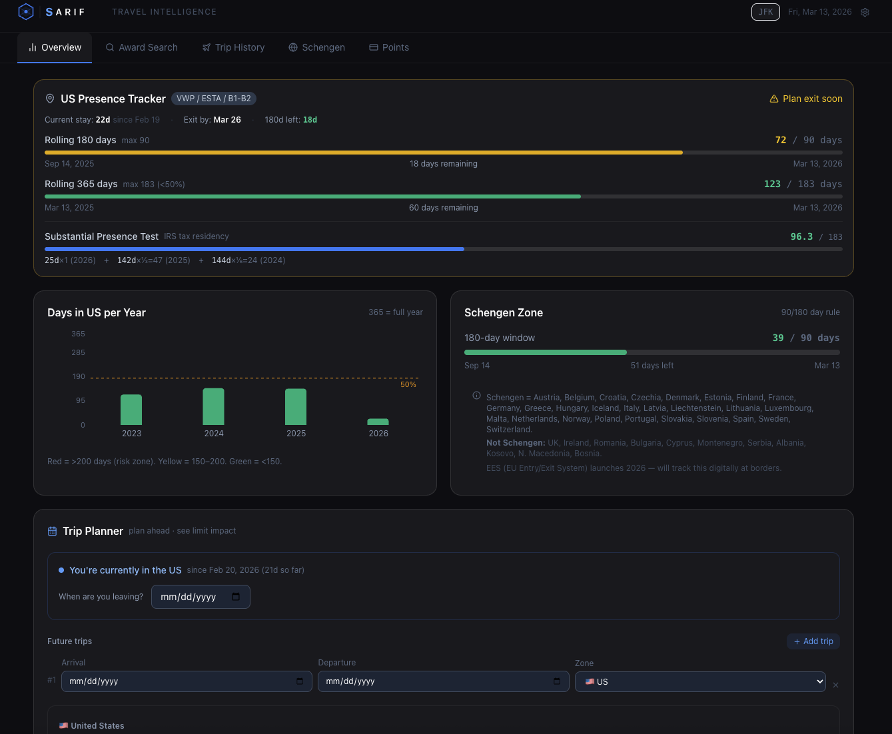

<p align="center">
  
</p>

<h1 align="center">Sarif</h1>

<p align="center">
  Travel intelligence dashboard for frequent flyers and digital nomads.
  <br>Award search, points tracking, US and Schengen stay counters. Runs locally.
</p>

<p align="center">
  <a href="https://github.com/jcdentonintheflesh/sarif/releases/latest"><strong>Download the desktop app</strong></a>
  &nbsp;·&nbsp;
  <a href="#run-from-source">Run from source</a>
</p>

---

## Desktop app (recommended)

Easiest way to get started. One file, no terminal needed.

1. Go to [**Releases**](https://github.com/jcdentonintheflesh/sarif/releases/latest)
2. Download the **.dmg** file (macOS Apple Silicon)
3. Open the .dmg, drag Sarif to Applications, done

Windows support is coming soon.

Everything runs on your machine. No account, no cloud, no tracking.

> macOS will show a security warning since the app isn't notarized yet. Right-click the app, click Open, then Open again. Standard for open-source apps outside the App Store.

## Run from source

If you'd rather run from source or want to contribute:

```bash
git clone https://github.com/jcdentonintheflesh/sarif.git
cd sarif/app
npm install
cp .env.example .env
npm run dev
```

Open [localhost:5173](http://localhost:5173). The app walks you through setup. Add `?demo` to the URL to try it with sample data first.

No Git? Click the green **Code** button on the repo page, Download ZIP, unzip, then run the commands above starting from `cd sarif/app`.

## API keys (optional)

Everything works without API keys. Award search and live prices light up once you add them.

| Key | What it powers | Where to get it | Cost |
|-----|---------------|-----------------|------|
| `SEATS_API_KEY` | Award search | [seats.aero](https://seats.aero) | $9.99/mo |
| `RAPIDAPI_KEY` | Business/PE cash prices | [Sky Scrapper on RapidAPI](https://rapidapi.com/apiheya/api/sky-scrapper) | Free (100 req/mo) or $8.99/mo (10k req) |
| `TRAVELPAYOUTS_TOKEN` | Economy cash baseline | [travelpayouts.com](https://www.travelpayouts.com/developers/api) | Free |

**Desktop app:** Add keys from Settings (gear icon) in the app. No file editing needed.

**Running from source:** Either add keys in Settings, or put them in `app/.env` (copy `.env.example`) and restart `npm run dev`.

## Overview



**Award Search** pulls live award availability from [seats.aero](https://seats.aero), which aggregates 30+ airline loyalty programs (United, Aeroplan, Flying Blue, etc.) into one API. Results show alongside cash prices from [Sky Scrapper](https://rapidapi.com/apiheya/api/sky-scrapper) (business/premium economy) and [Travelpayouts](https://www.travelpayouts.com/developers/api) (economy) so you can compare points vs. cash on the same screen.

**Points & Miles** tracks balances across your programs and shows which transferable currencies (Amex MR, Chase UR, etc.) can move where.

**US Presence Tracker** counts rolling 180-day and 365-day totals, runs the IRS Substantial Presence Test (the 3-year weighted formula), and suggests exit dates to avoid triggering tax residency.

**Schengen Tracker** does the same for the 90/180-day rule.

**Trip Planner** lets you simulate future trips against both US and Schengen limits before booking.


## Your data

Trips, points, and settings are stored locally on your device. Browser version uses localStorage, desktop app uses its own storage.

Your data persists through restarts, reboots, and updates.

The desktop app and browser version have **separate storage** and don't sync with each other. If you're switching from the browser version to the desktop app, use the export/import in Settings to move your data over.

**Backing up:** Settings (gear icon) > Export backup. Saves everything as a JSON file. Import backup to restore.

**Things that will delete your data:**
- Clicking "Start fresh" in Settings
- Clearing browser data (web version)
- Uninstalling the app without exporting first

## Stack

React 19, Vite, Tailwind CSS, Recharts, Express (API proxy), Electron (desktop), localStorage

## License

[MIT](LICENSE)

---

Built by [@vxdenton](https://x.com/vxdenton)
